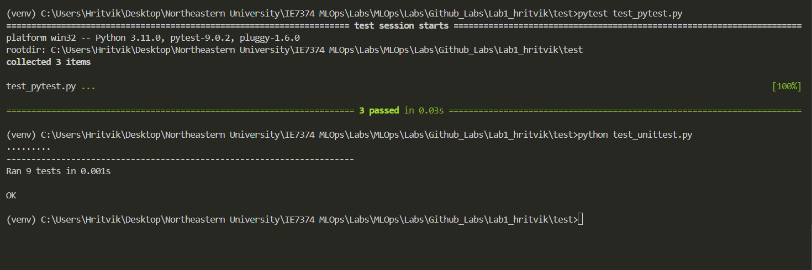
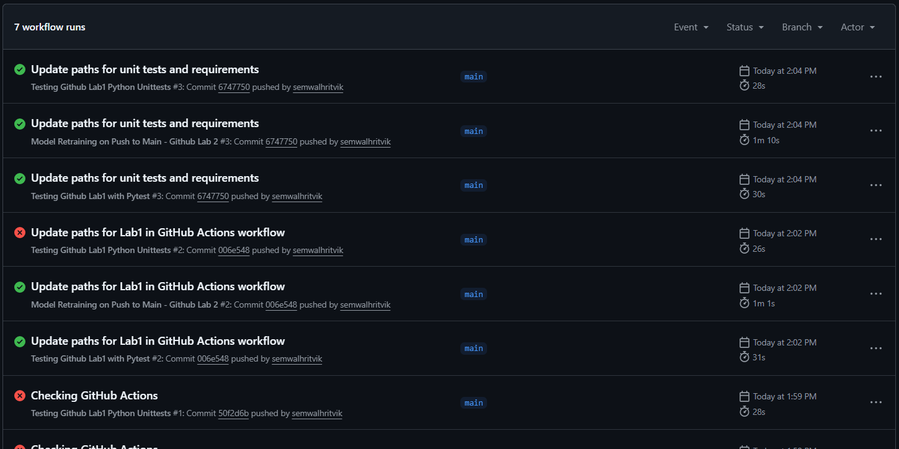

# GitHub Lab 1

This lab demonstrates the implementation of a basic Continuous Integration (CI) pipeline. We transitioned from a standard calculator example to a custom MoodBot utility to practice environment isolation, modular code structure, automated testing, and automated workflows using GitHub Actions.

1. Project Architecture
The project follows a standard production-ready folder structure:

src/: Contains the core logic (moodbot.py).
test/: Contains automated test suites for two different frameworks.
workflows/: Defines the automation rules for GitHub.
requirements.txt: Lists project dependencies to ensure environment parity.

2. Implementation Details
Core Logic (src/moodbot.py)
Developed a "Sanity Tracker" featuring three functions:
calculate_sanity: A mathematical function calculating academic well-being based on coffee and sleep.
get_status: A conditional logic function returning professional status strings.
generate_excuse: A boolean-driven string generator for late submissions.

Automated Testing (test/)
Implemented dual-framework testing to ensure full logic coverage:
Pytest: Used for concise, readable assertions and edge-case testing.
Unittest: Implemented class-based testing to follow Python's standard library conventions.

3. CI/CD Integration (GitHub Actions)
Configured two automated workflows triggered on every push to the main branch:
Pytest Workflow: Installs dependencies, runs the suite, and generates a test report.
Unittest Workflow: Validates the codebase using the standard unittest runner to ensure cross-framework compatibility.

4. Key Learnings
Environment Isolation: Using venv ensures that the project remains stable and avoids dependency conflicts, also updating requirements.
Import Resolution: Navigating Python's module system by using python -m pytest to correctly resolve src and test paths.
Edge Case Verification: The importance of testing boundary values (e.g., exactly 50 sanity points) to prevent logic errors.
Automation: Realizing how GitHub Actions acts as a "gatekeeper," ensuring that only code passing all tests is considered production-ready.
--

