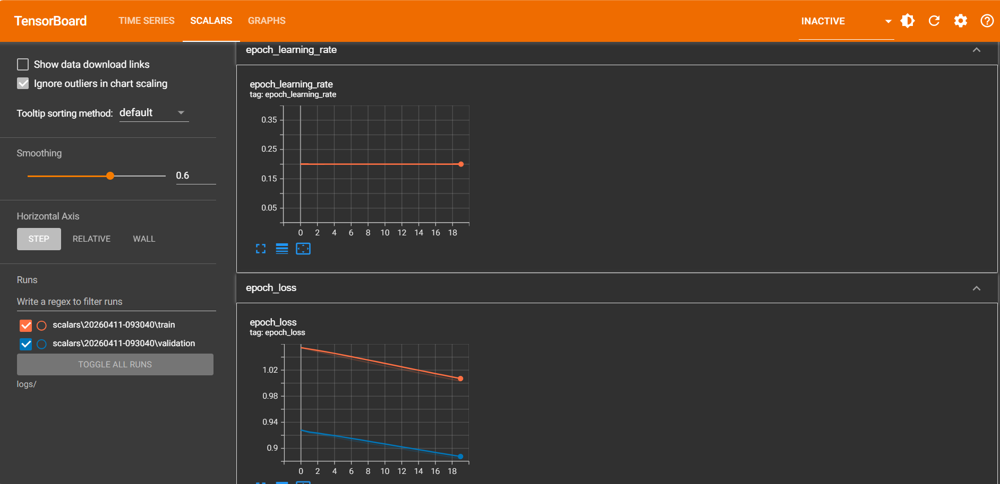

# TensorBoard Lab Demonstration

This lab demonstrates how to use **TensorBoard** within a Jupyter Notebook to monitor the training of a neural network model. 

## What We Did
1. **Prepared Data:** We took the real-world **Diabetes dataset** provided by Scikit-Learn. We used the BMI feature as our single input and standardized our targets to maintain stable training.
2. **Built the Model:** We built a small sequential neural network in TensorFlow/Keras with a single hidden line of 16 dense units.
3. **Training & Logging:** We compiled the model using Mean Squared Error (MSE) and Stochastic Gradient Descent (SGD). We then trained it on our data, while utilizing a `TensorBoard` callback to log the training history. 
4. **Visualized:** Finally, we launched TensorBoard inside the notebook to view important metrics such as Scalars (loss over time), the model Graph, and Distributions that help identify potential data anomalies.

## How to Rerun This Lab
Follow these simple steps:

1. **Prerequisites:** Make sure you have python installed along with the required libraries. You can install them by opening a terminal and running:
   ```bash
   pip install jupyterlab tensorflow scikit-learn numpy tensorboard
   ```
2. **Launch Jupyter:** In your terminal, navigate to this folder and start Jupyter Notebook:
   ```bash
   jupyter notebook
   ```
3. **Open the Notebook:** Click on `Lab1.ipynb` from the file explorer on the left.
4. **Run Cells:** Go to the top menu, click on **Run**, and select **Run All Cells**.
5. **View Results:** Head over to http://localhost:6006/ to view the results.


